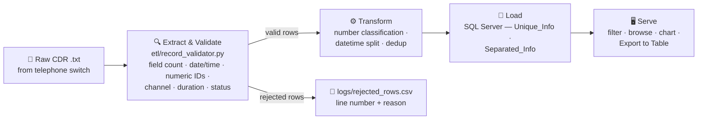

<div align="center">

# 📞 Data Engineering — Building a Small-Scale ETL Pipeline for Call-Center Records

### A desktop CDR pipeline — extract, validate, transform, load, and serve call-detail-records through a resilient Tkinter UI


</div>

<br>

> **TL;DR** — A phone system produces raw call-log files that need to
> become something people can actually search, filter, and learn from.
> This app imports those files into SQL Server, validates every row
> before it's stored, then lets staff browse, chart, and export the
> data — a small, self-contained pipeline wrapped in a desktop app.
>
> This project began as an internal tool built in 2020 during my time as
> a Python Developer at Pishronet. It processed call-detail records from a
> telephone switch, loading them into SQL Server to filter and extract
> call-centre staff data — using parameterized queries to prevent SQL
> injection, row-level input validation with a rejection log, an automated
> pytest suite, a 5-chart analytics dashboard, and batch-tracked exports.
>
> The project was built and finished in 2020-2021. It was pushed to
> GitHub in 2026.

<br>

## 📋 Contents

- [Overview](#-overview)
- [What It Had to Solve](#-what-it-had-to-solve)
- [How It Is Built](#️-how-it-is-built)
- [Pipeline](#-pipeline)
- [Project Layout](#-project-layout)
- [Export to Table](#-export-to-table--batch-tracked-lineage)
- [Dashboard](#-dashboard)
- [Data Validation](#-data-validation)
- [Setup](#-setup)
- [Configuration](#-configuration)
- [Tests](#-tests)
- [Known Limitations](#-known-limitations)

<br>

## 🎯 Overview

<table>
<tr>
<td width="25%" valign="top"><b>🧩 Problem</b></td>
<td>Turn raw call-detail-record text files from a telephone switch into something call-center staff can filter, browse, chart, and export — safely and repeatably</td>
</tr>
<tr>
<td valign="top"><b>📦 Origin</b></td>
<td>Built in 2020 at <b>Pishronet</b> as a Python Developer — an internal tool for the call-centre team, originally written in Persian</td>
</tr>
<tr>
<td valign="top"><b>🔧 This repo</b></td>
<td>Built and finished in 2020-2021; pushed to GitHub in 2026</td>
</tr>
<tr>
<td valign="top"><b>🗃️ Storage</b></td>
<td>SQL Server via <code>pyodbc</code>, parameterized queries throughout</td>
</tr>
<tr>
<td valign="top"><b>🖥️ Interface</b></td>
<td>A resizable Tkinter desktop app — filters sidebar, results table, analytics dashboard, batch-tracked exports</td>
</tr>
</table>

<br>

## 🧩 What It Had to Solve

A telephone switch writes one line per call, in a fixed-width text format
nobody can read directly. The call-centre team needed to answer ordinary
questions of it — who called, how long, how many were missed, which
channel — and needed the answers to be reliable enough to act on.

<details open>
<summary><b>The constraints that shaped it</b></summary>
<br>

- **Bad rows are normal.** A switch log carries truncated lines, impossible
  durations and malformed timestamps. Silently skipping them makes every
  later number quietly wrong, so each row is checked before it is stored
  and every rejection is written down with its reason.
- **The filters are user text.** Anything the staff type reaches a query,
  so every statement is parameterized — string concatenation would make
  the app injectable through its own filter box.
- **An export has to be answerable for.** "Where did this number come
  from?" needs an answer months later, so an export is a tracked batch
  with the filter that produced it recorded beside it, not a loose
  spreadsheet.
- **The database is not always there.** SQL Server being unreachable is a
  Tuesday, not an emergency: the connection is lazy, failures surface as a
  status-bar message, and the window stays usable.

</details>

<br>

## 🛠️ How It Is Built

Each piece exists for a reason, and they build on each other:

<table>
<tr><th align="left">#</th><th align="left">Phase</th><th align="left">What changed</th></tr>
<tr><td>1</td><td><b>Written for publication</b></td><td>Originally Persian-language for an internal team; every identifier, UI label, comment and message is English here, in idiomatic Python (PEP 8, small single-purpose functions)</td></tr>
<tr><td>2</td><td><b>Queries that cannot be injected</b></td><td>Every SQL statement is parameterized (<code>cursor.execute(sql, params)</code>) — the filter box is user input and reaches the database</td></tr>
<tr><td>3</td><td><b>A package per responsibility</b></td><td><code>core</code>, <code>database</code>, <code>etl</code>, <code>reporting</code>, <code>ui</code> — each one small enough to hold in your head</td></tr>
<tr><td>4</td><td><b>Failure is survivable</b></td><td>Lazy DB connection wrapped in a clear <code>DatabaseConnectionError</code>; every DB-touching button click shows a status-bar message instead of crashing; rotating file + console logging</td></tr>
<tr><td>5</td><td><b>Validate the data, don't just hope</b></td><td><code>etl/record_validator.py</code> checks every parsed row before it reaches the database; rejected rows go to <code>logs/rejected_rows.csv</code> with the reason, instead of vanishing</td></tr>
<tr><td>6</td><td><b>Add tests</b></td><td>A pytest suite covers every pure-logic module — classification, datetime splitting, query building, filter description, record validation, table-name sanitization</td></tr>
<tr><td>7</td><td><b>One visual system</b></td><td>A single theme module (<code>ui/theme.py</code>) defines colors/fonts/<code>ttk</code> styles; a responsive grid rather than pixel coordinates, so the window resizes</td></tr>
<tr><td>8</td><td><b>Reporting people can act on</b></td><td>A 5-chart Dashboard rendered with matplotlib embedded directly in the window — calls over time, by channel, by outcome, by hour, and duration bands</td></tr>
<tr><td>9</td><td><b>Export as a small data-warehouse pattern</b></td><td>"Export to Table" — batch-tracked, lineage-recorded exports into SQL Server itself, so every extract can be traced back to the filter that made it (see below)</td></tr>
</table>

> The result is one idea carried through: get data out of a text file and
> into something people can filter, browse and learn from — built the way
> that job is actually done, with parameterized queries, validated input,
> tracked lineage, tests, and a UI that doesn't fall over when the
> database isn't there.

<br>

## 🔄 Pipeline



<br>

## 📁 Project Layout

```
.
├── core/           shared constants and logging setup — no dependency on any other package
├── database/       config, DB connection, dropdown lookups
├── etl/            extract/transform/load pipeline (file import, validation, classification, dedup)
├── reporting/       export-to-table (batch-tracked), the analytics dashboard (aggregate queries + charts)
├── ui/             window, theme, frames, formatters
├── tests/          pytest unit tests for the pure-logic modules
├── scripts/        one-off developer scripts (e.g. sample data generation)
├── sql/            schema and seed scripts, run with sqlcmd
├── sample_data/    a ready-to-import sample call file for manual testing
├── logs/           rotating app log + rejected_rows.csv (created at runtime, not tracked in git)
└── main.py         entry point
```

> `core` has no imports from `database`/`etl`/`reporting`/`ui`, so it can
> be imported from anywhere without pulling in `tkinter`, `pyodbc`, or
> `matplotlib`.

<br>

## 📤 Export to Table — batch-tracked lineage

The "Export to Table" button saves whatever is currently in the results
table (filtered or not) into a SQL Server table — a small batch/lineage
pattern instead of a plain data dump:

- A dialog lists existing export tables in a combobox you can also type a
  new name into. Names are sanitized (letters, digits, underscores only)
  and always created under the `Export_` prefix — e.g. `"MonthlyReport"` →
  `Export_MonthlyReport` — keeping every export discoverable via
  `SELECT name FROM sys.tables WHERE name LIKE 'Export_%'`.
- Every export also inserts one row into a shared `Export_Batches` table
  (`BatchID`, `TableName`, `ExportedAt`, `FilterCriteria`, `RecordCount`),
  and every row written to the target table carries that `ExportBatchID`
  as a foreign key — so any export is traceable back to *when* it was
  made, *what was in it*, and *what filter produced it*.
- Exporting an empty results table is rejected with a status-bar message
  rather than silently creating an empty table.
- The same dialog has a **Delete** button (with confirmation) for removing
  a table you picked from the list — it can only target `Export_*` tables
  already created this way, never an arbitrary table by name.

<br>

## 📊 Dashboard

The "Dashboard" button opens a window with **five charts** computed
straight from `Separated_Info` — one aggregate SQL query per chart
(`reporting/dashboard_data.py`), rendered with matplotlib embedded
directly in the window (`reporting/dashboard_window.py`), not separate
popups:

<table>
<tr><th align="left">#</th><th align="left">Chart</th><th align="left">What it shows</th></tr>
<tr><td>1</td><td>Call Status Breakdown</td><td>Answered / busy / no-answer / failed, as a share of all calls</td></tr>
<tr><td>2</td><td>Call Origin Mix</td><td>External / Brokerage / Box, by caller section</td></tr>
<tr><td>3</td><td>Call Volume by Month</td><td>Call counts per Year-Month, for spotting trends</td></tr>
<tr><td>4</td><td>Average Talk Time by Origin</td><td>Mean handle time (answered calls only) — a core efficiency metric</td></tr>
<tr><td>5</td><td>Top 10 Busiest Channels</td><td>Which trunks/channels carry the most traffic</td></tr>
</table>

> If there's no data in `Separated_Info` yet, the window shows a single
> "No data yet" placeholder instead of five empty or misleading charts.

<br>

## ✅ Data Validation

Every row parsed from an imported `.txt` file is checked by
`etl/record_validator.py` **before** it reaches the database:

<table>
<tr><td>Field count</td><td>A plausible date/time</td><td>Numeric caller & called numbers</td></tr>
<tr><td>Non-empty channels</td><td>Duration-shaped ring/talk times</td><td>Non-empty status</td></tr>
</table>

Rows that fail are skipped (not inserted) and written to
`logs/rejected_rows.csv` with the line number and the reason, instead of
silently disappearing. The import summary in the status bar reports how
many rows were imported vs. rejected.

<br>

## 🚀 Setup

```bash
pip install -r requirements.txt
python main.py
```

> An ODBC driver for SQL Server must be installed separately (a
> system-level driver, not a Python package).

<details>
<summary><b>Database setup — first-time SQL Server install</b></summary>
<br>

```bash
sqlcmd -S <server\instance> -i sql\schema.sql
```

This creates the `Users` database (if missing), `Unique_Info`,
`Separated_Info`, and the five `Dropdown_*` lookup tables, seeded with the
section/status values the app expects (`All`, `External`, `Brokerage`,
`Box`, `Invalid`, plus the status values). The channel-code dropdowns
start with just `All`, since real channel codes come from imported call
data — after your first import, run:

```bash
sqlcmd -S <server\instance> -i sql\refresh_channel_dropdowns.sql
```

to populate them from whatever codes actually showed up in
`Separated_Info`.

</details>

<br>

## 🔧 Configuration

Connection settings are read from environment variables, with sensible
local defaults:

<table>
<tr><th align="left">Variable</th><th align="left">Default</th></tr>
<tr><td><code>ANALYZER_DB_DRIVER</code></td><td><code>SQL Server</code></td></tr>
<tr><td><code>ANALYZER_DB_SERVER</code></td><td><code>.</code></td></tr>
<tr><td><code>ANALYZER_DB_NAME</code></td><td><code>Users</code></td></tr>
<tr><td><code>ANALYZER_DB_USERNAME</code></td><td><i>(unset)</i></td></tr>
<tr><td><code>ANALYZER_DB_PASSWORD</code></td><td><i>(unset)</i></td></tr>
</table>

> If username/password are unset, a trusted (Windows) connection is used.

<br>

## 🧪 Tests

```bash
pip install pytest
pytest
```

> Covers only the pure-logic modules — number classification, datetime
> splitting, query building, filter description, record validation,
> table-name sanitization — nothing that touches a live database or the
> GUI.

<br>

## 📌 Known Limitations

- The section/status constants in `core/constants.py` (`External`,
  `Brokerage`, `Box`, `Invalid`, `All`) are English, but a database
  populated by the earlier Persian-language version will still contain
  the old Persian values in `Dropdown_*`, `Unique_Info`, and
  `Separated_Info` — filtering won't match existing rows until the
  database is migrated.
- `Separated_Info` is a single denormalized table, not a dimensional
  (fact/dimension) model — a reasonable next step at larger scale, not
  done here.
- The pipeline runs on demand (button click), not on a schedule or
  file-watch trigger — no orchestration layer (Airflow, cron, etc.); this
  is a desktop tool, not a service.

<br>

## 🛠️ Tech Stack


<br>

---

<div align="center">
<sub>A small, self-contained data engineering pipeline — extract → validate → transform → load → serve — wrapped in a desktop UI.</sub>
</div>
